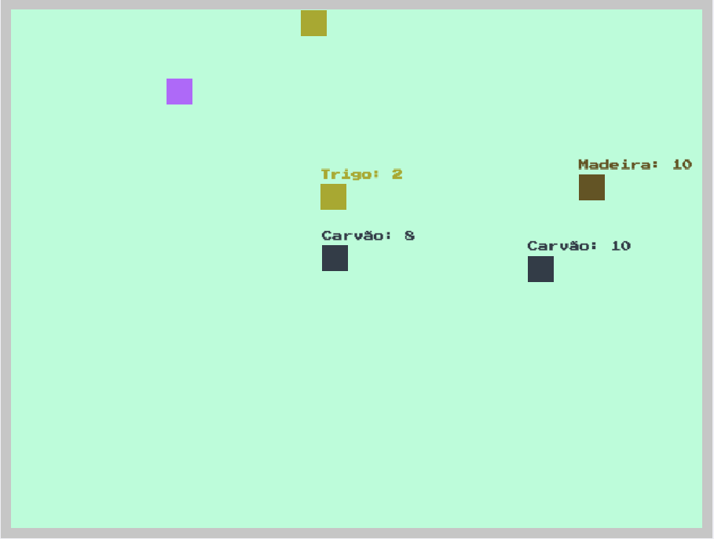

<h1 align="center">
    
</h1>

<h4 align="center">
   Desenvolvimento do jogo de sobrevivência 2D 👾
</h4>

<h4/>
<p align="center">
  
<p/>

<p align="center">
  
</p>

# 🕹️ Motivação
A intenção desse projeto é a criação de um jogo bem simples

## :bulb: Clone do projeto
Abaixe o projeto com 
```shell
git clone https://github.com/Throyer/typescript-game.git # HTTPS
ou
git clone git@github.com:Throyer/typescript-game.git # SSH
```

# 📺 Executando jogo
```shell
 # baixe as dependencias
 yarn install 

 # se você usa o npm
 npm install

 # rode no modo "desenvolvimento"
 yarn dev

 # se você usa o npm
 npm run dev

 # se você quiser gerar o projeto em js tem um comando de build
 # o resultado fica na pasta "./dist"
 yarn build

 # se você usa o npm
 npm run build
```
 
## :computer: Tecnologias
  
Tecnologia utilizada:
- [Node.js](https://nodejs.org/en/)
- [Typescript](https://www.typescriptlang.org/)
---
Jogo desenvolvido por 🎮 | [@throyer](https://github.com/Throyer) | [@thelokys](https://github.com/thelokys)
